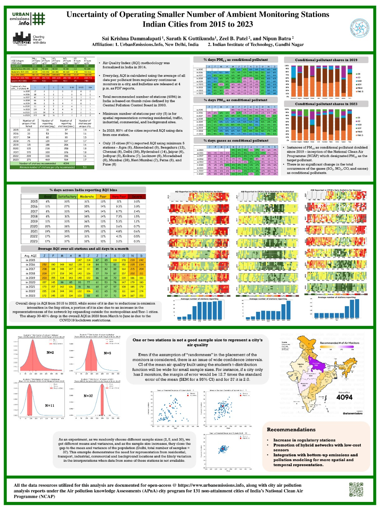
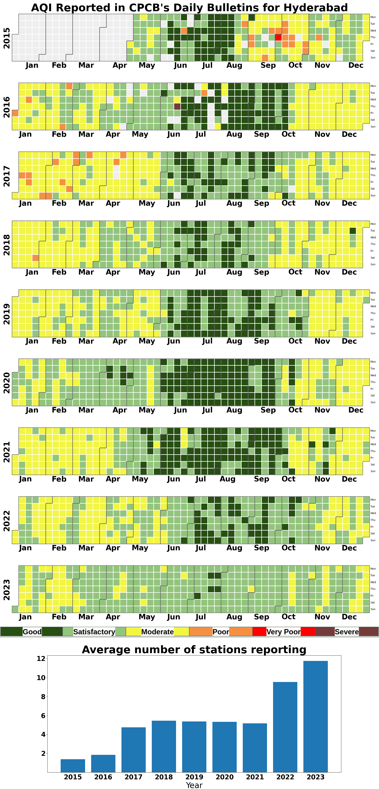

## AQI Analysis for Indian Cities from 2015 to 2023

This research project is presented at the iCACGP-IGAC Conference 2024, Kuala Lumpur. [Abstract](https://icacgp-igac2024.com/wp-content/uploads/2024/08/A144.-Sai-Krishna-Dammalapati.pdf)

Detailed report can be accessed here: [AQI Analysis for Indian cities from 2015-2023](https://urbanemissions.info/wp-content/uploads/docs/SIM-47-2024.pdf)

This repository contains analysis of AQI Daily bulletins released by the Central Pollution Control Board (CPCB) since 2015. These daily bulletins can be currently obtained here: [CPCB Daily AQI Bulletins](https://cpcb.nic.in/AQI_Bulletin.php)

The data contains (available) day-wise `city-average AQI value`, `AQI category`, and `conditional pollutant` information. This data for all cities can be obtained in the  `AllIndiaBulletins_master.csv` from `data/Processed` folder.

City wise AQI bulletins CSV and calendar plots can be obtained on UrbanEmissions website: [Link](https://urbanemissions.info/india-air-quality/india-ncap-aqi-indian-cities-2015-2023/)

## Codes
1. `pdfparser.py`: Extracted tables from all AQI bulletins from 2015.
2. `clean.py`: Cleans all CSVs extracted and creates `AllIndiaBulletins_Master.csv`. Then manually cleaned `City` column for duplicates. (Chihuahua problem)
3. `cal_heatmaps.py`: Creates calendar heatmaps for each city. 
4. `aqi_research.py`: Creates CSVs and plots that answers a few research questions as follows:

    1. total unique cities by year 
    2. total unique cities by month
    3. total number of monitoring stations by year
    4. total number of monitoring stations by month
    5. Average number of monitoring stations per city by year 
    6. Average number of monitoring stations per city by months
5. Dr. Nipun Bhatra produced the plots that capture the uncertainty in AQI values with smaller number of stations. [Link to the code](https://nipunbatra.github.io/blog/posts/2024-sample-distribution.html). More explanation of this uncertainty can be found here: [Document](<assets/Issue with less number of air quality monitoring stations.pdf>)

6. Calendar plot of the AQI values is produced for each city, along with the average number of stations reporting AQI value in each year. The following is a sample calendar plot for the city of Hyderabad.

To produce such calendar heat maps, refer to our Climate Visuals repository: [Calendar Heatmap](https://github.com/urbanemissions-info/ClimateVisuals/blob/main/Calendar%20Heatmap.ipynb)

7. `Box Annotations.ipynb`: It is the script used to build the Bokeh data application of the AQI data. The data application is live here: [Link](https://urbanemissionsinfo.github.io/AQI_bulletins/)

